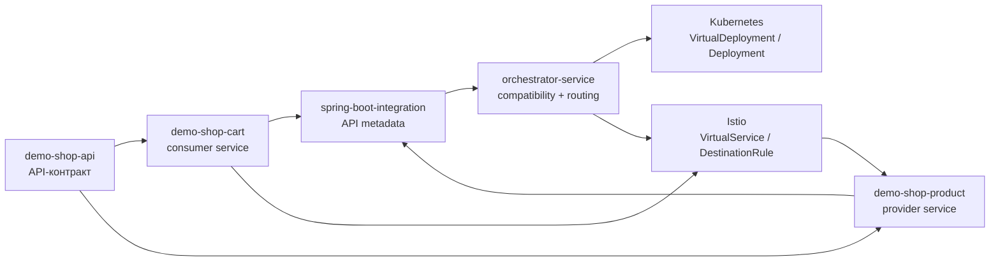
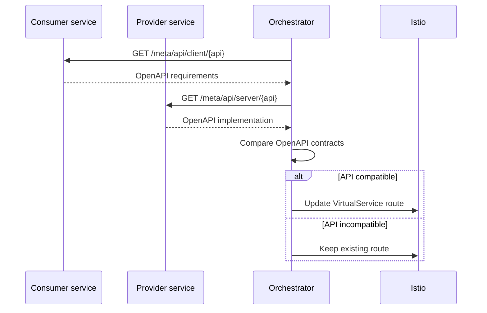
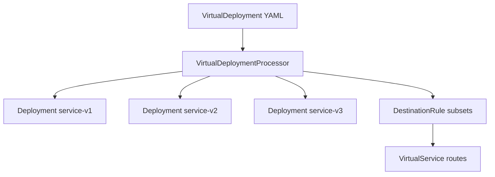
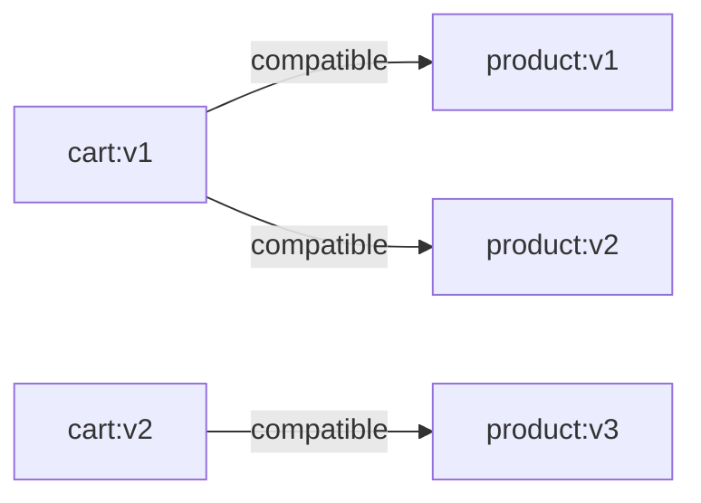
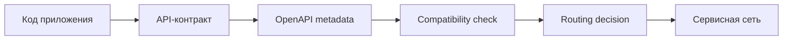

# Диаграммы

Диаграммы можно использовать в тексте диплома и презентации. Они написаны в формате Mermaid, который поддерживается многими Markdown viewer'ами.

## Общая архитектура

## Последовательность проверки совместимости

## Развертывание через VirtualDeployment

## Граф совместимости

## Контур дипломного решения

